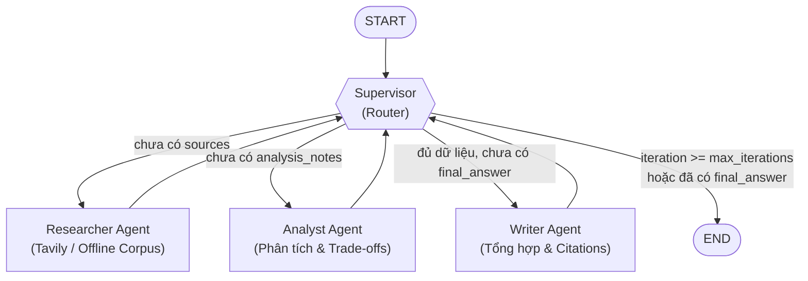

# Design Document: Multi-Agent Research System

## 1. Problem Statement

Xây dựng hệ thống trợ lý nghiên cứu tự động (**Autonomous Research Assistant**) có khả năng nhận câu hỏi/chủ đề nghiên cứu phức tạp, tự động tìm kiếm và thu thập tài liệu từ nhiều nguồn (online Tavily hoặc offline corpus 30 topics), phân tích đối chiếu các luận điểm kỹ thuật, đánh giá độ tin cậy của bằng chứng, và tổng hợp thành báo cáo hoàn chỉnh có trích dẫn nguồn tường minh (`[1]`, `[2]`, ...).

---

## 2. Why Multi-Agent?

- **Khắc phục Context Dilution (Loãng ngữ cảnh):** Khi một agent đơn lẻ vừa phải tìm kiếm, vừa đọc hiểu hàng ngàn từ tài liệu, vừa phân tích và viết báo cáo, context window bị quá tải dẫn đến việc bỏ sót thông tin quan trọng hoặc phát sinh hallucination.
- **Tách biệt trách nhiệm (Separation of Concerns):** Mỗi agent đảm nhiệm một vai trò chuyên biệt (Tìm kiếm -> Phân tích -> Viết báo cáo -> Kiểm chứng).
- **Khả năng kiểm soát và quan sát (Observability & Debuggability):** Trạng thái trung gian được lưu trong `ResearchState`, cho phép trace chính xác agent nào thực thi, thời gian bao lâu, tốn bao nhiêu token và phát hiện lỗi ở bước nào.

---

## 3. Agent Roles & Specifications

| Agent | Responsibility | Input | Output | Failure Mode & Mitigation |
|---|---|---|---|---|
| **Supervisor** | Điều phối vòng đời nghiên cứu, kiểm tra state và quyết định agent tiếp theo; kích hoạt cơ chế dừng. | `ResearchState` | Cập nhật `route_history`, chuyển giao quyền cho Worker hoặc kết thúc (`done`). | *Infinite loop Supervisor ↔ Worker.*  ↳ **Mitigation:** Thiết lập cứng `max_iterations = 6`. |
| **Researcher** | Tra cứu tài liệu (Tavily API hoặc offline corpus), lọc tài liệu liên quan và trích xuất tóm tắt. | `state.request.query`, `state.request.max_sources` | `state.sources`, `state.research_notes`, `AgentResult` | *Không tìm thấy nguồn hoặc API lỗi.*  ↳ **Mitigation:** Fallback sang dataset offline 30 chủ đề. |
| **Analyst** | Đọc hiểu tài liệu, trích xuất luận điểm cốt lõi, so sánh trade-off kỹ thuật, đánh giá độ tin cậy. | `state.sources`, `state.research_notes` | `state.analysis_notes`, `AgentResult` | *Dữ liệu đầu vào rỗng.*  ↳ **Mitigation:** Kiểm tra guardrail, ghi nhận `state.errors` và fallback sang kiến thức tổng quát. |
| **Writer** | Tổng hợp báo cáo nghiên cứu hoàn chỉnh, định dạng Markdown chuyên nghiệp, gắn inline citations. | `state.analysis_notes`, `state.sources` | `state.final_answer`, `AgentResult` | *Thiếu trích dẫn nguồn.*  ↳ **Mitigation:** Prompt bắt buộc cấu trúc citation và danh mục References. |
| **Critic (Bonus)**| Kiểm định chéo chất lượng báo cáo, tính toán tỷ lệ phủ trích dẫn và phát hiện hallucination. | `state.final_answer`, `state.sources` | `AgentResult(critic)`, đánh giá chất lượng. | *Ảo giác hoặc trích dẫn sai nguồn.*  ↳ **Mitigation:** Kiểm tra đối soát regex chỉ số citation. |

---

## 4. Shared State Design (`ResearchState`)

`ResearchState` là nguồn chân lý duy nhất (**Single Source of Truth**) được truyền tuần tự qua các agent:

| Field | Kiểu dữ liệu | Mục đích sử dụng |
|---|---|---|
| `request` | `ResearchQuery` | Chứa câu hỏi gốc, số lượng nguồn tối đa (`max_sources`), và đối tượng độc giả (`audience`). |
| `iteration` | `int` | Đếm số lần chuyển giao giữa các agent, dùng làm guardrail chống lặp vô hạn. |
| `route_history` | `list[str]` | Nhật ký lưu lại chuỗi điều phối (vd: `['researcher', 'analyst', 'writer', 'done']`). |
| `sources` | `list[SourceDocument]` | Danh sách tài liệu thu thập được kèm title, url, snippet và metadata. |
| `research_notes` | `str \| None` | Ghi chú thô được Researcher tổng hợp từ các nguồn tài liệu. |
| `analysis_notes` | `str \| None` | Báo cáo phân tích chuyên sâu và so sánh của Analyst. |
| `final_answer` | `str \| None` | Báo cáo tổng hợp cuối cùng của Writer với đầy đủ trích dẫn citation. |
| `agent_results` | `list[AgentResult]` | Lưu trữ nội dung và metadata chi tiết (tokens, cost USD) của từng agent. |
| `trace` | `list[dict]` | Danh sách sự kiện span/event phục vụ observability và latency tracking. |
| `errors` | `list[str]` | Ghi nhận các cảnh báo hoặc lỗi phát sinh trong quá trình thực thi. |

---

## 5. Routing Policy & Graph Architecture

---

## 6. Guardrails & Failure Protections

- **Max Iterations:** Giới hạn tối đa 6 vòng lặp handoff (`MAX_ITERATIONS=6`), ngắt ngay lập tức khi chạm ngưỡng để bảo vệ chi phí token.
- **Timeout Protection:** Cấu hình timeout 60 giây (`TIMEOUT_SECONDS=60`) cho mọi lời gọi HTTP/API.
- **Retry Mechanism:** Áp dụng `tenacity` với Exponential Backoff (3 lần thử, giãn cách 1-6s) khi gọi API ngoài.
- **Fallback Strategy:** Tự động chuyển đổi mượt mà giữa OpenAI API và Mock LLM / Dataset offline 30 topics khi không có internet hoặc thiếu API key.
- **Schema Validation:** Toàn bộ dữ liệu vào ra được validate chặt chẽ thông qua Pydantic V2 (`ResearchQuery`, `SourceDocument`, `AgentResult`, `ResearchState`).

---

## 7. Benchmark Plan

- **Bộ câu hỏi đánh giá:** 3 chủ đề nghiên cứu từ `configs/lab_default.yaml` (GraphRAG, Multi-Agent Support, Production Guardrails).
- **Hệ thống Metrics đo lường:**
  1. `Latency (seconds)`: Thời gian phản hồi end-to-end.
  2. `Cost (USD)`: Chi phí token tiêu thụ ước tính.
  3. `Quality Score (0-10)`: Điểm chất lượng cấu trúc, độ sâu phân tích và trích dẫn.
  4. `Citation Coverage (%)`: Tỷ lệ tài liệu nguồn được trích dẫn trong câu trả lời cuối.
  5. `Failure Rate (%)`: Tỷ lệ truy vấn gặp lỗi nghiêm trọng.
